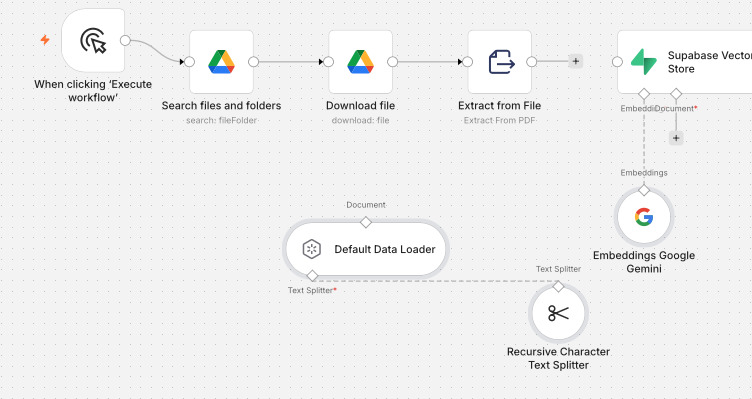
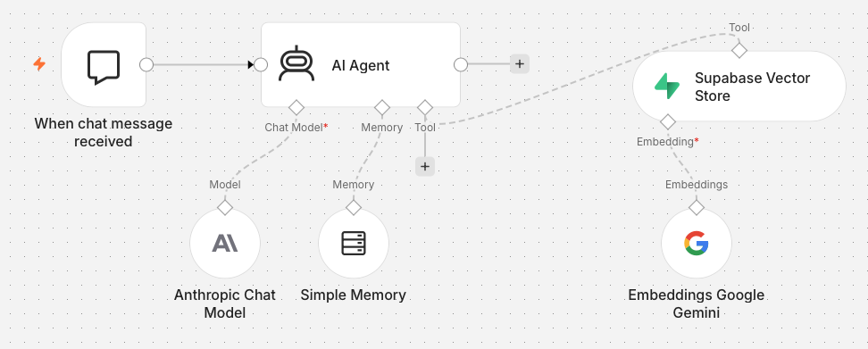
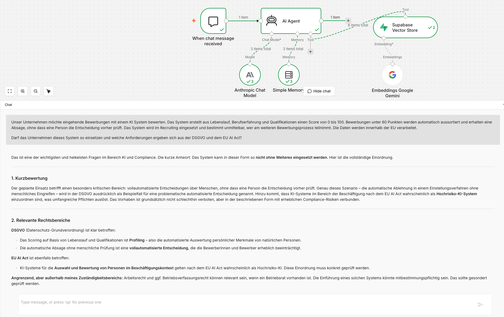

# AI Compliance Agent

Independently designed and implemented a modular RAG based AI compliance agent in n8n.

The system retrieves legal context from a structured GDPR and EU AI Act knowledge base and provides practical compliance guidance for employees using AI in a business context.

It asks targeted follow up questions, identifies relevant risks and translates complex legal requirements into clear next steps.

## Project Overview

The AI Compliance Agent is a functional MVP for the structured assessment of business questions related to GDPR and the EU AI Act.

It supports employees who need clear initial guidance before using AI tools in a business context.

The agent combines legal retrieval, targeted follow up questions and structured risk guidance. It provides initial compliance orientation and does not replace professional legal review.

The project demonstrates independent workflow design, modular system integration, prompt engineering, retrieval testing and iterative quality improvement.

## Core Capabilities

1. Retrieves relevant legal context from a structured GDPR and EU AI Act knowledge base.

2. Assesses business questions involving personal data, profiling, automated decisions, transparency, data transfers and AI risk classification.

3. Asks targeted follow up questions when essential information is missing.

4. Translates legal context into practical guidance, prioritized risks and clear next steps.

5. Maintains a defined compliance scope and declines unrelated requests.

6. Clearly separates initial compliance guidance from legal advice.

## System Architecture

The solution consists of two separate n8n workflows.

### 1. Knowledge Import Workflow

This workflow imports the GDPR and EU AI Act source files, extracts the text, splits the content into searchable sections, generates Gemini embeddings and stores the resulting vectors in Supabase.



[View Knowledge Import Workflow JSON](workflows/knowledge_import_workflow.json)

### 2. Agent Workflow

This workflow receives user questions, retrieves relevant legal context from Supabase, maintains conversation memory and uses Claude to generate structured compliance guidance.

Separating knowledge ingestion from the agent logic keeps the architecture modular, easier to test and easier to extend.



[View Agent Workflow JSON](workflows/agent_workflow.json)

## Tech Stack

**n8n Cloud**

Orchestrates the two modular workflows for knowledge ingestion and agent interaction.

**Anthropic Claude Sonnet 4.6**

Interprets user questions and generates structured compliance guidance.

**Supabase with pgvector**

Stores legal text embeddings and enables semantic retrieval of relevant legal context.

**Google Gemini Embeddings**

Converts legal source content and user queries into vector representations for semantic search.

**Simple Memory**

Maintains conversation context and supports targeted follow up questions.

**Google Drive**

Provides the source files used by the knowledge import workflow.

## Workflow Logic

1. A user submits a business question through the n8n chat interface.

2. The AI Agent checks whether the question falls within the scope of GDPR or the EU AI Act.

3. For relevant questions, the agent retrieves legal context from Supabase through semantic search.

4. Claude combines the retrieved context with the conversation history and the system prompt.

5. If essential information is missing, the agent asks one targeted follow up question at a time.

6. The response is structured into an initial assessment, relevant legal areas, reasoning, risks, practical actions, missing information and a legal disclaimer.

7. Requests outside the defined compliance scope are declined. The agent only explains when a possible compliance connection could arise.

## Repository Structure

```text
ai-compliance-agent
├── README.md
├── LICENSE
├── docs
│   ├── testing.md
│   └── example_output.md
├── images
│   ├── agent_workflow.png
│   ├── knowledge_import_workflow.png
│   └── agent_response_example.png
└── workflows
    ├── agent_workflow.json
    └── knowledge_import_workflow.json
```

## Testing and Validation

The agent was tested with defined business scenarios covering both GDPR and EU AI Act relevance. 

### Example Agent Output

The screenshot below shows a representative excerpt from a validated recruiting compliance scenario. It demonstrates the structured assessment, identification of relevant legal areas and practical compliance guidance.



The complete example output, including the original user question and full compliance assessment, is available in the documentation.

[View the complete example output](docs/example_output.md)

Test cases included:

1. AI supported customer service with personal data.

2. Employee productivity scoring based on email, calendar and chat data.

3. Automated transcription and emotion analysis of customer calls.

4. Marketing requests outside the defined compliance scope.

The tests validated legal retrieval, targeted follow up questions, scope control and practical response structure.

The complete test documentation is available here:

[View testing and validation documentation](docs/testing.md)

The system prompt was refined iteratively to improve clarity, legal caution, tool usage and relevance for employees.

## Key Design Decisions

1. Knowledge ingestion and agent interaction were separated into two workflows. This improves modularity, testing and maintenance.

2. Retrieval augmented generation was used to ground responses in a dedicated GDPR and EU AI Act knowledge base.

3. The prompt logic prioritizes one focused knowledge search. A second search is used only when additional legal context is needed.

4. The response structure was designed for employees without specialist legal knowledge.

5. Document upload was removed from the MVP to reduce privacy risks and keep the scope controlled.

6. The system provides structured initial guidance and does not present its output as legal advice.

## Known Limitations

1. The project is a functional portfolio MVP designed for controlled demonstration and supervised testing. It is not intended for unsupervised production deployment or autonomous legal decision making.

2. Response quality depends on the imported legal sources, the retrieved context and the information provided by the user.

3. High risk use cases and unclear regulatory questions require human review by qualified legal or data protection professionals.

4. The current version does not support document uploads through the chat interface. This was a deliberate scope and privacy decision for the MVP.

5. The knowledge import workflow can return a vector validation error after processing. Valid legal text sections remain stored and available for retrieval.
